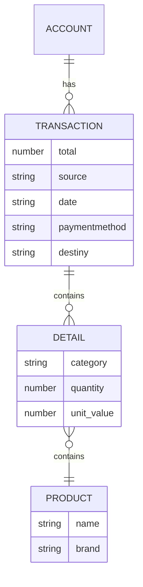
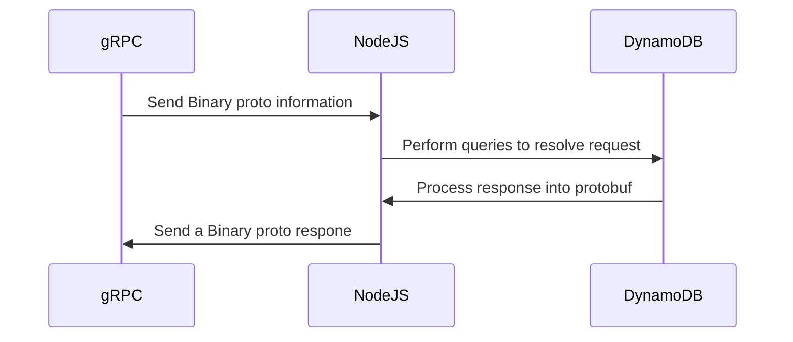

[](https://www.codacy.com/gh/FintrackOrg/fintrack-transactions-service/dashboard?utm_source=github.com&utm_medium=referral&utm_content=FintrackOrg/fintrack-transactions-service&utm_campaign=Badge_Grade)

# Fintrack Transaction Service

This micro-service is responsible of store every transaction and return those values based on some queries. The system is build on top of Clean Architecture using Domain Driven Design as the philosophy

## Clean Architecture

### Domain

In simple terms, this micro-service hold four definitions: account, transaction, detail and product.

- Account: The account responsibility here is make a relation between the transaction and the account
- Transaction: Store the main information about the transaction
- Detail: Show all the information inside a transaction, specially the product value
- Product: The product responsibility is to relate which product was in the detail without specifying the price

This means: to know the product price, is mandatory to specify from which detail was used the product.

#### Entity-Relation

The relation between entities is defined in the next diagram:



### Application

The transaction service can perform some actions:

- Create transaction specifying details
- Create transaction without details
- Get transactions by date
- Get transaction details by transaction id
- Get products by transaction id
- Get all products on a date

### Infraestructure

#### Tech Stack



#### gRPC

```proto
service TransactionService {
    rpc GetTransactionsByAccount (GetTransactionsByAccountRequest) returns (GetTransactionsByAccountResponse) {}
    rpc CreateAccountTransaction (CreateAccountTransactionRequest) returns (CreateAccountTransactionResponse) {}
}
```

#### JSON transaction Schema

Between microservices, a transaction can be delivery following the next schema:

```json
{
	"transaction": {
		"id": "1",
		"accountId": "1",
		"userId": "1",
		"type": "TRANSACTION"
		"source": "D1",
		"total": 76740,
		"date": "2023-03-05",
		"paymentMethod": "CASH",
		"destiny": "BASIC",
		"details": []
	}
}
```

#### DynamoDB Table design

The transaction service is designed using **Single-Table design**. With this approach, all the data is stored in a unique table. The table look like:

##### Transaction Table - Transaction View

<table>
	<thead>
	<tr>
      <th colspan="2" bgcolor="#F5F5F5">Primary Key</th>
      <th colspan="9" bgcolor="#F5F5F5">Attributes</th>
    </tr>
    <tr>
      <th>PK</th>
      <th>SK</th>
      <th>Type</th>
      <th>Id</th>
      <th>AccountId</th>
      <th>UserId</th>
      <th>Source</th>
      <th>Total</th>
      <th>Date</th>
      <th>PaymentMethod</th>
      <th>Destiny</th>
    </tr>
    </thead>
    <tbody>
    	<tr>
          <td>ACCOUNT#1</td>
          <td>TRANSACTION#2023-03-05#1</td>
          <td>TRANSACTION</td>
          <td>1</td>
          <td>1</td>
          <td>1</td>
          <td>D1</td>
          <td>76740</td>
          <td>2023-03-05</td>
          <td>CREDIT</td>
          <td>BASIC</td>
    	</tr>
        <tr>
          <td>ACCOUNT#1</td>
          <td>TRANSACTION#2023-03-06#2</td>
          <td>TRANSACTION</td>
          <td>2</td>
          <td>1</td>
          <td>1</td>
          <td>Exito</td>
          <td>234519</td>
          <td>2023-03-06</td>
          <td>CASH</td>
          <td>BASIC</td>
    	</tr>
        <tr>
          <td>ACCOUNT#2</td>
          <td>TRANSACTION#2023-03-05#3</td>
          <td>TRANSACTION</td>
          <td>3</td>
          <td>2</td>
          <td>4</td>
          <td>Exito</td>
          <td>234519</td>
          <td>2023-03-05</td>
          <td>CASH</td>
          <td>BASIC</td>
    	</tr>
    </tbody>
</table>

##### Transaction table - Detail View

<table>
	<thead>
	<tr>
      <th colspan="2" bgcolor="#F5F5F5">Primary Key</th>
      <th colspan="5" bgcolor="#F5F5F5">Attributes</th>
      <th colspan="2" bgcolor="#F5F5F5">Global Secondary Index</th>
    </tr>
    <tr>
      <th>PK</th>
      <th>SK</th>
      <th>Type</th>
      <th>Id</th>
      <th>Category</th>
      <th>Quantity</th>
      <th>UnitValue</th>
      <th>GS1PK</th>
      <th>GS1SK</th>
    </tr>
    </thead>
    <tbody>
    	<tr>
          <td>TRANSACTION#1</td>
          <td>DETAIL#2023-03-05#1</td>
          <td>DETAIL</td>
          <td>1</td>
          <td>FOOD</td>
          <td>2</td>
          <td>50000</td>
          <td>ACCOUNT#1</td>
          <td>PRODUCT#1</td>
    	</tr>
        <tr>
          <td>TRANSACTION#1</td>
          <td>DETAIL#2023-03-05#2</td>
          <td>DETAIL</td>
          <td>2</td>
          <td>FOOD</td>
          <td>1</td>
          <td>16740</td>
          <td>ACCOUNT#1</td>
          <td>PRODUCT#2</td>
    	</tr>
        <tr>
          <td>TRANSACTION#2</td>
          <td>DETAIL#2023-03-05#3</td>
          <td>DETAIL</td>
          <td>3</td>
          <td>PETS</td>
          <td>1</td>
          <td>234519</td>
          <td>ACCOUNT#1</td>
          <td>PRODUCT#3</td>
    	</tr>
    </tbody>
</table>


##### Transaction table - Product View

<table>
	<thead>
	<tr>
      <th colspan="2" bgcolor="#F5F5F5">Primary Key</th>
      <th colspan="9" bgcolor="#F5F5F5">Attributes</th>
    </tr>
    <tr>
      <th>PK</th>
      <th>SK</th>
      <th>Type</th>
      <th>Id</th>
      <th>Name</th>
      <th>Brand</th>
    </tr>
    </thead>
    <tbody>
    	<tr>
          <td>ACCOUNT#1</td>
          <td>PRODUCT#1</td>
          <td>PRODUCT</td>
          <td>1</td>
          <td>Leche deslactosada x 16</td>
          <td>D1</td>
    	</tr>
        <tr>
          <td>ACCOUNT#1</td>
          <td>PRODUCT#2</td>
          <td>PRODUCT</td>
          <td>2</td>
          <td>Pan tajado integral</td>
          <td>Mami</td>
    	</tr>
    </tbody>
</table>

## DynamoDB Queries
Based on the previous use cases and table design, each action can be resolved in the following approach

### Create transaction specifying details

- The transaction
```typescript
PK: { S: 'ACCOUNT#1' },
SK: { S: 'TRANSACTION#2023-03-05#1' },
Type: { S: "TRANSACTION" },
Id: { S: "1" },
AccountId: { S: "1" },
UserId: { S: '1' },
Source: { S: 'D1' },
Total: { N: '76740' },
Date: { S: '2023-03-05' },
PaymentMethod: { S: 'CASH' },
Destiny: { S: "BASIC" },
```

- The details
```typescript
[
  {
    PK: { S: 'TRANSACTION#1' },
    SK: { S: 'DETAIL#2023-03-05#1' },
    Type: { S: "DETAIL" },
    Id: { S: "1" },
    Category: { S: "FOOD" },
    Quantity: { N: '2' },
    UnitValue: { N: '50000' },
  },
  {
    PK: { S: 'TRANSACTION#1' },
    SK: { S: 'DETAIL#2023-03-05#2' },
    Type: { S: "DETAIL" },
    Id: { S: "1" },
    Category: { S: "FOOD" },
    Quantity: { N: '1' },
    UnitValue: { N: '16740' },
  }
]
```
- The products
```typescript
[
  {
    PK: { S: 'ACCOUNT#1' },
    SK: { S: 'PRODUCT#1' },
    Type: { S: "PRODUCT" },
    Id: { S: "1" },
    Name: { S: "Leche deslactosada x 16" },
    Brand: { N: 'D1' },
  },
  {
    PK: { S: 'ACCOUNT#1' },
    SK: { S: 'PRODUCT#2' },
    Type: { S: "PRODUCT" },
    Id: { S: "2" },
    Name: { S: "Pan tajado integral" },
    Brand: { N: 'Mami' },
  }
]
```

##### Create transaction without details

- The transaction
```typescript
PK: { S: 'ACCOUNT#1' },
SK: { S: 'TRANSACTION#2023-03-05#1' },
Type: { S: "TRANSACTION" },
Id: { S: "1" },
AccountId: { S: "1" },
UserId: { S: '1' },
Source: { S: 'D1' },
Total: { N: '76740' },
Date: { S: '2023-03-05' },
PaymentMethod: { S: 'CASH' },
Destiny: { S: "BASIC" },
```

##### Get transactions by date

```typescript
ExpressionAttributeValues: { ":pk": `ACCOUNT#1`, ":sk": `TRANSACTION#2023-03` },
KeyConditionExpression: "PK = :pk and begins_with(SK, :sk)",
TableName: this.TABLE_NAME,
```

##### Get transaction details by transaction id

```typescript
ExpressionAttributeValues: { ":pk": `ACCOUNT#1`, ":sk": `TRANSACTION#2023-03-05#1` },
KeyConditionExpression: "PK = :pk and SK = :sk",
TableName: this.TABLE_NAME,
```
##### Get products by transaction id


```typescript
ExpressionAttributeValues: { ":pk": `ACCOUNT#1`, ":sk": `PRODUCT#2` },
KeyConditionExpression: "PK = :pk and SK = :sk",
TableName: this.TABLE_NAME,
```
##### Get all products on a date

```typescript
ExpressionAttributeValues: { ":pk": `ACCOUNT#1`, ":sk": `2023-03` },
KeyConditionExpression: "PK = :pk and begins_with(SK, :sk)",
TableName: this.TABLE_NAME,
```
